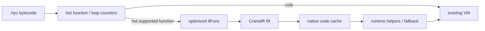

# AOT and JIT optimization roadmap

This document turns the current performance measurements into an ordered
optimization plan. The interpreter remains the compatibility path; new
optimizations must preserve archive compatibility and the existing VM
semantics.

## Baseline

Run the repeatable matrix with:

```bash
./scripts/perf_matrix.sh
```

The script builds the release binary, checks each benchmark checksum, compares
the four cross-language benchmarks (plus restored `fib`) against Lua and Node, runs the Coil-only
examples, and writes raw `poop` output plus metadata under
`/tmp/coil_perf_matrix/`. Set `OUT_DIR` for another location, `DURATION_MS`
for longer samples, or `RUN_MASSIF=1` to collect optional Valgrind Massif files.

The 2026-08-08 release baseline used precompiled Coil archives and 6-second
`poop` comparisons:

| Benchmark | Coil | Lua | Node | Dominant signal |
|-----------|------|-----|------|-----------------|
| `mandelbrot` | 32.5 ms | 15.0 ms | 15.8 ms | 573M VM instructions; numeric loop dispatch |
| `tak` | 2.09 ms | 1.31 ms | 13.4 ms | recursive direct-call/frame overhead |
| `nsieve` | 2.72 ms | 1.00 ms | 14.2 ms | array mutation, indexing, and bounds/object checks |
| `binary_trees` | 12.9 ms | 9.24 ms | 15.2 ms | heap allocation and GC |

Post–float-fusion soft baseline (`./scripts/poop_baseline.sh`, 2026-08-10):
`mandelbrot` ~19.6 ms / 392M instructions, `tak` ~2.17 ms, `nsieve` ~2.73 ms,
`binary_trees` ~12.4 ms (still directional; re-run `perf_matrix.sh` for cross-lang).

Coil used about 5.9–7.4 MB RSS, Lua 2.7–3.2 MB, and Node 89–91 MB. These are
directional comparisons rather than language rankings: the ports have
different runtime startup, library, and allocation behavior.

After the AOT harvest below (slot promotion, the counted-loop length proofs, the
aggregate builders, the argument-spill peel), a 3-second re-run of the same
matrix reads:

| Benchmark | Coil | Lua | Node |
|-----------|------|-----|------|
| `mandelbrot` | 31.1 ms | 14.8 ms | 15.7 ms |
| `tak` | 1.92 ms | 1.33 ms | 12.9 ms |
| `nsieve` | 2.52 ms | 0.98 ms | 14.0 ms |
| `binary_trees` | 12.3 ms | 9.18 ms | 15.1 ms |

Every checksum matched and no benchmark regressed. The matrix runs each
cross-language row twice — once with `COIL_AUTO_PAR=0` and once with auto-par at
its default — and the two rows are now indistinguishable within noise on all
four, because under the work score of item 6 none of these loads has a fork site
that scores above the threshold. That is the intended reading: fair sequential
benchmarks pay nothing for auto-par being compiled in.

The repository also has Coil-only `numeric`, `operators_loop`, and `match_sum`
benchmarks. Their current results are retained by the matrix, but they have no
Lua or Node ports.

## Recently landed (float AOT)

Source-ordered float work on the interpreter path (no FMA / reassociation):

- LICM: full invariant float expression chains (past intermediate height-1).
- `FloatChainStore`: up to three stages; `BinSlotSlot` stage0; const-pool operands.
- `BinSlotSlotConstJmpf`: float mag arith + pool compare + `JMPF`.
- `NEGF` unary float negate.
- Algebraic: exact `+0.0` / `+1.0` float identities; const-pool float binop fold.
- Codegen: `new Class(args).field` scalar replacement (no temp instance).
- Operand-order canon (`il::canon` + `CanonStats`): const-to-RHS / load-load slot order; int `ConstPool` demote into inline `CONST` when safe; bounds accepts post-canon `GT` headers.

Next AOT priorities below remain the main gap vs Lua on `mandelbrot` /
`tak` / `nsieve` / `binary_trees`.

## Landed since register-win harvest (ceiling contract)

Late-August IL work is **on `main`** under [`OptLevel`](../../compiler/src/il/opt/opt_level.rs)
(`Standard` = default production). This is what actually ships — not a textbook
pass list. Ceilings from the Aug investigation batch still bind; Linear Done
titles can oversell.

| Area | What landed | Ceiling (do not overshoot in docs or code) |
|------|-------------|--------------------------------------------|
| **Opt levels** | `-O0`…`-O3`, `-Os`, `-Og` via CLI / `Pipeline::set_opt_level` | `None ⊂ Basic ⊂ Standard ⊂ Aggressive`. `Size` drops unroll + return cloning; `Debug` = Basic only (no slot promote, escape, unroll, GVN). |
| **`cfg_gvn`** (`gvn.rs`) | Intra-block CSE + identical-tail join-sink when SP-in agrees | **No SSA slot rename** (COI-82). Effectful ops are barriers. Dup-CSE re-expanded before lower for fuse-select. |
| **`ssa_gvn`** (`gvn_ssa.rs`) | Virtual `Phi(block,slot)` VNs; redundant pure `Const`/`Load`+`Bin` → `Load` when value already in a slot | **Not rename.** `DIV`/`MOD`/`DIVF`/`MODF` excluded. Also runs inside per-body `cfg_gvn_with` when enabled. |
| **`escape_analysis`** | Immediate-only `MakeArray` (arity ≤ 32) → consecutive frame slots | Fail-closed on escape. Computed elements stay heap. **Not** named-local class SROA (COI-84). |
| **`loop_bounds`** | Length invariance; `ArrayLen` + const-address hoists to preheader | **`Index` stays checked** — no `IndexUnchecked` (COI-85). `LEQ`/`GEQ` headers are **not** length proofs (COI-93). |
| **`loop_unroll`** | Full unroll counted natural loops, trip ≤ 8 | Calls, `break`, nested loops refuse. `LEQ` accepted for **trip count** only — separate from bounds Index proofs (COI-98). |
| **`invert` + `*Jmpt`** | `JMPF; JMP` → `JMPT`; fuse-select emits fused `*Jmpt` twins | Loop headers stay `*Jmpf` (COI-87). |
| **`seek_back_edge`** | `Seek` latch to expose in-loop self-stores when header becomes `Known` | **Default off** on `Standard`. COI-97 measured fuse loss on mandelbrot; outer-loop Seek splits `FloatChainStore`. **`Aggressive` / `-O3` turns it on** — production `Standard` stays off until re-measured. |
| **PGO** | `--pgo-instrument` / `--pgo-use-profile` two-phase plumbing | Compile-time only. Decision opts may prioritize hot loops when a profile is loaded. **Not proven** on the benchmark matrix (measurement suite still open). |
| **`iterative_optimization`** | Fixpoint re-runs of the IL pipeline | **Default off** (COI-130). |
| **`collect_stats`** | Per-pass counters to stderr / JSON | **Default off** (`--opt-stats`, COI-131). |
| **Branch layout / block reorder** | Profile/heuristic layout + sink jump-only terminators | Default **on** (COI-128 / COI-129). Known-SP gates; module-wide label watermark. |

**Still open (not done):** length invariance across **pure** helper calls inside
`while i < len(b)` loops — [COI-99](https://linear.app/ardax/issue/COI-99).
Still no `IndexUnchecked`. Inlining / predicate peel / direct `new Class(args).field`
scalar replacement live in **codegen**, not `il/opt` (self-recursive peel refused,
COI-86). No JIT — Cranelift section below remains a feasibility sketch.

Pass headers in `compiler/src/il/**` are the source of truth when this table
and Linear disagree.

## AOT priorities

### 1. Local slot promotion and SSA-like values

Priority: highest. **Status: Phases 1–4 of register-win harvest landed**
(`perf/register-wins-harvest`; docs ledger in § Opcode candidate ledger below).

The shared operand/local stack still makes repeated `LOAD` / `STORE` traffic
expensive. Two GVN layers share the **COI-82 ceiling** — no real SSA slot rename:

- **`cfg_gvn`** (`gvn.rs`) — intra-block CSE plus identical-tail join-sink when
  SP-in agrees at the join; effectful ops are barriers.
- **`ssa_gvn`** (`gvn_ssa.rs`) — virtual `Phi(block,slot)` value numbers; only
  rewrites a redundant pure `Const`/`Load`+`Bin` tail back to `Load` when that
  value already lives in a slot (`DIV`/`MOD` excluded). **Not rename.**

Copy propagation in `opt/dce.rs` stays straight-line and tell-safe only.

**Landed (Phases 1–4, IL-only — no new opcodes):**

- store-destination coalescing and peel-param raise (`opt/slot_promote.rs`);
- copy-only latch elision when live-out / unique in-loop def allow;
- Phase 4 fuse-feed audit: FCS / `BinSlotSlotConstJmpf` / packed peels held;
  residual near-misses tallied in `perf_metrics` for the ledger.

**Harvested without opcodes (shape inventory):**

- `tak`: LOAD 11→7, STORE 7→3, `slot_move` 4→0 (coalesce + peel raise);
- fuse windows intact across mandelbrot / tak / numeric / nsieve.

Still deferred for a later SSA-like slice: overlapping live-range φ shuffles
(mandelbrot `tr`→`zr`), **real** rename across disagreeing joins, and operand-stack
retention across calls. `ssa_gvn` does not deliver that slice — see landed table
above. Measure residual candidates against the ledger before appending opcodes.

A second, narrower slice sits at the end of the pipeline: `slot_promote_at`
uses `tell` as the whole safety proof — a `STORE t` reached with the cursor at
`t + 1` writes TOS back to its own address, and the reload run in front of a
`TailCall` re-pushes values the call already finds on the stack. Together those
take argument-materialization temps out of the frame (`tak`: 4 LOAD words / 9
slots / 3 STOREs → 3 LOAD words / 6 slots / 0 STOREs). Joins are free: `tell`
poisons a point whose predecessors disagree, so `Known` is agreement.
Operand height (`il::sp`) is a different quantity — `STORE` floors tell without
raising height — and stays split (COI-81); see
[limitations](limitations.md#il-optimizations-low).

What neither slice does yet (see
[limitations](limitations.md#il-optimizations-low) for the full refusal table):

- **Real slot liveness.** Without it, promotion must leave every slot with a
  visible def, which rules out `CALL` operand runs (the callee frame base is
  `tell - arity`) and any store whose slot is still read.
- **Cursor normalization at loop back edges (COI-97, won't-do on `Standard`).**
  Innermost mandelbrot has no tell-proven self-stores. A `Seek` on an *outer*
  latch drops `cr`'s store and splits `FloatChainStore`. Prototype lives behind
  `seek_back_edge` (**default off** on `Standard`; `Aggressive` / `-O3` turns it
  on). Tests use a synthetic raising loop because mandelbrot does not hit the
  profitable shape.
- **Scheduling.** `mandelbrot`'s `tr → zr` copy cannot coalesce because `zr` is
  read between the def and the copy; sinking the def past that read is the fix.
- **`Bin(slot, TOS)` operand shapes.** `mandelbrot`'s remaining `LOAD 5` / `LOAD
  6` feed an `ADDF` whose other operand is on the stack, which no existing fused
  form accepts. That is an opcode question, not a promotion one.

### 2. Loop range and bounds analysis

Priority: high (first slice landed).

`Index` and `StoreIndex` still perform runtime object lookup and signed bounds
checks in `machine/src/vm.rs`, and that has not changed: the landed slice is
proof-only and touches no VM handler.

`il::bounds.rs` proves **length invariance** per natural loop instead of
per-index bounds. `StoreIndex` overwrites an element in place, so a loop that
writes `a[i]` still has an invariant `len(a)`; `ArrayPush`, a call, a host
native or any unmodelled op refuses the region. Two invariant materializations
move to the preheader on that proof — the `LOAD a; ArrayLen; STORE t` triple
codegen leaves in the header of `while i < len(a)`, and the `CONST imm; STORE t`
pair that materializes a constant addressing operand in `a[i] = 0`. `nsieve`'s
sieve loop went from 8 words per iteration to 6 (545.6k → 469.9k dispatches);
`examples/perf/vec_scan.hy`, the `while i < len(v)` scan/fill shape, from 6.58M
to 5.01M. Safety comes from the cursor: the preheader store floors it at
`t + 1`, and every in-loop stack height staying at or above the header's proves
no in-loop push can reach `t`.

What is still open (full refusal table in
[limitations](limitations.md#il-optimizations-low)):

- **`0 <= i < len` is not proven at all.** Induction-variable detection was
  deliberately left out because nothing consumes the fact: without an unchecked
  addressing form the proof cannot change a single emitted word. `loop_unroll`
  may accept `LEQ` for **trip count** — that meaning is separate from bounds
  Index proofs (COI-98 / COI-93). Pair in-bounds work with an opcode decision,
  not with this pass alone.
- **Loops that call a helper on `b[i]`.** Most stdlib `while i < len(b)` loops do,
  and a call could `push` to the array through another reference. Wiring the
  existing purity/effect summaries into the barrier test is the widest available
  win here.
- **The `find_object_by_addr` lookup per `Index`.** Hoisting the resolved array
  means keeping a heap address live across a GC point in IL; the length hoists
  precisely because it is an `int`.

### 3. Allocation and GC fast paths

Priority: high for heap-heavy code (aggregate builders inspected; the win is in
the allocator, not the copy).

The premise this item started from was wrong. `MakeTuple` / `MakeArray` do not
collect into a *temporary* `Vec<Value>`: `ObjTuple`/`ObjArray` take that vector
by value (`elements`), as `ObjEnum` does with `payload`, so the collect already
*is* the object's payload. There was no second allocation to remove, and the one
that remains cannot be dropped by a fixed-arity fast path — only by giving
aggregates inline element storage, which is a layout change.

What the pass over the handlers did change is the shape of the copy. Elements
already sit contiguously in declaration order on the operand stack, so
`Stack::top_window` lets a builder borrow its whole argument window:
`MakeTuple`/`MakeArray` take it in one `to_vec` memcpy instead of a pop loop
plus a reverse, and `MakeEnum` classifies the window top-first through an
exact-size collect. Same opcodes, layouts, element order and GC rooting. This
measured **performance-neutral** on `binary_trees` — within `poop` noise — which
is the useful result: aggregate construction is not copy-bound.

The remaining cost per object is in `Heap::alloc` itself, and it is structural:

- one `Box::new(GcData::new(..))` per object, on top of the payload vector;
- one `addr_index` insert per allocation and one removal per sweep, because
  `find_object_by_addr` is a hash lookup keyed by raw address;
- `alloc_bytes` versus `gc_next_threshold` as the only collection trigger.

So the next slice is the allocator and the address index — arena/region backing
for `GcData`, or a cheaper object-identity scheme than a per-address hash — not
the aggregate opcodes. Keep GC rooting correct before and after allocation, and
consider batch allocation only once object lifetime boundaries are explicit.
This remains the most direct path for `binary_trees` and is independent of a
JIT.

### 4. Direct-call and closure specialization

Priority: medium. **Status: partial (B4 landed).** The caller-side predicate
peel landed; the recursive peel was measured and refused.

Landed for monomorphic known targets:

- ground trait / instance method sites emit direct `CALL` instead of
  `CodePtr` + `CallIndirect` when the entry and arity are static;
- self-recursive predicate peels (provisional body spans) so nested `tak`
  calls skip base-case frames;
- existing tiny direct-call inlining / monomorphization unchanged.

Still use `CallIndirect` for PolyFn locals, dictionary `Index` targets, and
generic shared-body evidence that is not static at the call site.

`tak`'s frame traffic has been measured and is **not** worth peeling: a frame
costs about two dispatches here, so the caller-side predicate peel loses to it
(+73.5% VM instructions on `tak`). The peel now only removes argument spills,
which is a win wherever it already fired: arguments that compile to a single
pure byte are re-materialized in the guard instead of spilled, worth 4.28G →
3.29G instructions and 189 ms → 152 ms on a peel-heavy loop. See
`limitations.md` for the cost model and the full refusal table. Further `tak`
work has to remove the call itself — real inlining of a recursive body, or a
frame representation cheaper than `CALL` — not move the guard.

### 5. Dispatch and trace fusion

Priority: medium to low until measured.

`Machine::execute` already uses outlined dispatch, unchecked stack access, and
typed/fused opcodes. Larger universal superinstructions or short trace fusion
should be considered only if they improve multiple benchmarks. Keep symbolic IL
and the single `il::lower` pass as the source of truth; do not add an opcode
for one benchmark shape. Residual fuse near-misses after Phases 1–4 are scored
in the opcode candidate ledger below — none are an unconditional **add**.

## Opcode candidate ledger (register-win harvest Phase 5)

Scored after IL opts on Phases 1–4. **Docs only — no new opcodes from this
ledger until a candidate clears the gates.** Evidence is static shape inventory
in `compiler/tests/perf_metrics.rs` plus estimated dynamic weight on hot
benches. Append-only opcode rules still apply ([AGENTS.md](../../AGENTS.md)).

**Gates for `add`:** residual dynamic weight still material after Phases 1–4;
pattern universal (not a single-bench special); no safe IL rewrite exposes an
existing opcode; fits append-only opcode ABI.

| Family | Evidence (post Phases 1–4) | Est. dynamic weight | Recommendation | Rationale |
|--------|----------------------------|---------------------|----------------|-----------|
| `*Jmpt` counterparts (`CmpJmpt` / `BinSlot*Jmpt` / `BinSlotSlotConstJmpt` / …) | mandelbrot escape `BinSlotSlotConstJmpt`; `would_be_jmpt_after_invert=0`; tak/nsieve/numeric stay 0 | ~1.28M/run (iter escape, one dispatch not two) | **done** ([COI-87](https://linear.app/ardax/issue/COI-87)) | Invert fused `*Jmpf; JMP` into `*Jmpt`. Same packing as the false twins. Loop headers remain `*Jmpf`. |
| Cast spill → `FloatChainStore` | mandelbrot `cr`/`ci` casts | material in mandelbrot float body | **done** | Hoist `LOAD; Cast` to float temps (`il::cast_spill`, default on) + fuse stage0 `LOAD;CONST` / const-under (existing ext flags). |
| Function tree-shake | eager `Hash__*`/`Show__*`/… thunks in archives | binary size / dissect noise | **done** | Reachability prune before lower (`il::treeshake`); roots = `main` (+ tests when included). |
| Unused-slot DCE across jumps | assignment-only locals kept by jump-as-used | IL store noise | **done** | `dead_store` whole-body unread slots ignore Jump/Label; cursor proof unchanged. |
| `FloatChain` 4-stage / wider | `float_chain_stage_cap_leftover=0` | — | **defer** | No truncation leftover on current benches; zero evidence for a wider opcode. |
| `MoveSlot` / φ shuffle | mandelbrot `loop_carried_phi_shuffle=1` (`tr`→`zr`); IL opts refused overlapping live ranges | ~2.56M dispatches/run (LOAD+STORE latch) | **needs more proof** (or defer pending benches) | Largest residual dispatch count, but mandelbrot-heavy; tak/numeric/nsieve have 0 latch shuffles. Needs universality proof (more loop-carried programs) before an append-only `MoveSlot` / rename op. Overlapping ranges may still need SSA rename rather than a 1-op shuffle. |
| Unchecked `Index` / `StoreIndex` | nsieve static Index=1 + StoreIndex=1 in hot loops | nsieve-dominant | **needs more proof** | Align with roadmap §2: diagnostics and bounds proofs first; opcode only after proof-only analysis shows a universal safe fast path. **`ssa_gvn` / escape / unroll do not remove Index checks today.** |
| Unary slot / float `BinSlotImm` / packing holes | 0 on mandelbrot/tak/numeric/nsieve | — | **defer** | Zero evidence on the hot matrix. |
| Slot move (non-latch) | numeric `slot_move` ≤3 (format/host temp) | low | **defer** | Not loop-carried; format-path noise, not a fuse candidate. |

**Already harvested without opcodes:** see §1 (tak LOAD/STORE/`slot_move`; fuse windows held). Next opcode work should re-run `perf_metrics` inventories and only promote a ledger row that still passes the `add` gates.

### 6. Auto-par fork-site profitability

Priority: landed; the cutoff itself is unchanged.

IPA specialization used to gate on `max(args)`, which reads argument
*magnitude* as work. `par_profit.rs` now scores a fork site by counting the
guard-pruned fork-site nodes a concrete arg vector reaches, then converts that
count back into fib-equivalent units, so `COIL_PAR_THRESHOLD` keeps its
calibration and the default stayed at **20**. What changed is only the verdict
on shapes that are not fib-shaped: `tak(24, 22, 20)` (53 real calls) now
refuses, and the fair `tak(18, 12, 6)` bench load lands exactly on the cutoff
and stays sequential. Every imprecision resolves downwards, so unknown
structure can only refuse. Full formula and verdict table in
[auto-par](auto-par.md#the-work-score).

The work cost is compile-time and bounded by construction: the walk is memoized
per `(fn, arg vector)`, capped at 256 levels deep and 2^14 memo entries, and
saturates one node past the cutoff — counting further cannot change the answer.
The specialization closure on top of it is breadth-first and capped at 64
clones per function. Nothing runs at execution time, and below-threshold or
dynamic arg sites stay on the sequential original, so there is no hot-path
threshold tax.

## Cranelift JIT feasibility

The current VM is a good fallback runtime but not a direct native ABI:

- `Value` is an untagged machine word containing immediates or raw heap
  pointers;
- locals and operands share `Stack<Value>` with a mutable `tell` cursor;
- `Frame` stores bytecode IP and stack base, while calls can re-enter through
  FFI callbacks;
- `HostInvoke`, FFI, coroutines, `CallIndirect`, debugger stops, and GC all
  require runtime coordination.

Cranelift's `JITBuilder` / `JITModule` provide the required define, finalize,
and function-pointer lookup operations:

- [JITBuilder](https://docs.rs/cranelift-jit/latest/cranelift_jit/struct.JITBuilder.html)
- [JITModule](https://docs.rs/cranelift-jit/latest/cranelift_jit/struct.JITModule.html)

Keep this dependency optional in a new `coil-jit` crate or a `jit` feature.
It should not be part of the default compiler or VM build.



### Initial JIT tier

Compile only functions containing typed numeric operations, local loads/stores,
comparisons, symbolic branches, and returns. Exclude heap allocation, field
access, host/FFI calls, coroutines, indirect calls, and debugger sessions.
This gives a useful first tier without requiring GC stack maps or speculative
deoptimization.

Use an opaque runtime context rather than exposing `Stack<Value>` internals:

```text
JitEntry(context, frame_base, stack_cursor) -> JitExit
JitExit = { reason, value, resume_pc }
```

The native body may use virtual registers for supported locals and return a
value directly. Unsupported work returns `JitExit::Fallback`; the interpreter
continues from a known bytecode boundary. Native code must not retain a heap
pointer across a helper or allocation call in this tier.

### Hotness and installation

- Count function entries first; add loop back-edge counters only after function
  JIT compilation is stable.
- Use a configurable threshold and an opt-in `--jit` / feature flag.
- Key compiled code by archive identity, function entry, and JIT version.
- Keep a runtime side table from bytecode entry PC to either bytecode or native
  entry; do not change archived `CALL` operands.
- Disable JIT dispatch while debugger state is attached, or force a deopt
  boundary before every debugger-visible operation.

## Staged gates

1. **Baseline gate:** `perf_matrix.sh` produces metadata and raw results for
   every comparison; no benchmark is accepted without a correctness checksum.
2. **AOT gate:** an optimization must improve a target benchmark by at least
   5% wall time or 10% VM instructions without regressing any benchmark by
   more than 2%, and must pass the full language and cursor-differential
   suites.
3. **JIT prototype gate:** compile one pure numeric function, call it from the
   VM, and fall back to bytecode for one unsupported operation. Verify identical
   output, no archive/opcode changes, and code-cache cleanup.
4. **JIT promotion gate:** include compile latency, warm-up time, steady-state
   wall time, RSS, and fallback frequency. Promote only if `mandelbrot` or
   `tak` improves materially after warm-up costs; otherwise prioritize slot
   promotion and allocation work.

Required verification remains:

```bash
cargo check --workspace
cargo test --workspace --lib --tests --bins
./target/debug/coil test
./scripts/perf_matrix.sh
```
