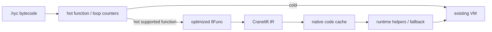

# AOT and JIT optimization roadmap

This document turns the current performance measurements into an ordered
optimization plan. The interpreter remains the compatibility path; new
optimizations must preserve archive compatibility and the existing VM
semantics.

## Baseline

Run the repeatable matrix with:

```bash
./scripts/perf_matrix.sh
```

The script builds the release binary, checks each benchmark checksum, compares
the four cross-language benchmarks (plus restored `fib`) against Lua and Node, runs the Coil-only
examples, and writes raw `poop` output plus metadata under
`/tmp/coil_perf_matrix/`. Set `OUT_DIR` for another location, `DURATION_MS`
for longer samples, or `RUN_MASSIF=1` to collect optional Valgrind Massif files.

The 2026-08-08 release baseline used precompiled Coil archives and 6-second
`poop` comparisons:

| Benchmark | Coil | Lua | Node | Dominant signal |
|-----------|------|-----|------|-----------------|
| `mandelbrot` | 32.5 ms | 15.0 ms | 15.8 ms | 573M VM instructions; numeric loop dispatch |
| `tak` | 2.09 ms | 1.31 ms | 13.4 ms | recursive direct-call/frame overhead |
| `nsieve` | 2.72 ms | 1.00 ms | 14.2 ms | array mutation, indexing, and bounds/object checks |
| `binary_trees` | 12.9 ms | 9.24 ms | 15.2 ms | heap allocation and GC |

Post–float-fusion soft baseline (`./scripts/poop_baseline.sh`, 2026-08-10):
`mandelbrot` ~19.6 ms / 392M instructions, `tak` ~2.17 ms, `nsieve` ~2.73 ms,
`binary_trees` ~12.4 ms (still directional; re-run `perf_matrix.sh` for cross-lang).

Coil used about 5.9–7.4 MB RSS, Lua 2.7–3.2 MB, and Node 89–91 MB. These are
directional comparisons rather than language rankings: the ports have
different runtime startup, library, and allocation behavior.

After the AOT harvest below (slot promotion, the counted-loop length proofs, the
aggregate builders, the argument-spill peel), a 3-second re-run of the same
matrix reads:

| Benchmark | Coil | Lua | Node |
|-----------|------|-----|------|
| `mandelbrot` | 31.1 ms | 14.8 ms | 15.7 ms |
| `tak` | 1.92 ms | 1.33 ms | 12.9 ms |
| `nsieve` | 2.52 ms | 0.98 ms | 14.0 ms |
| `binary_trees` | 12.3 ms | 9.18 ms | 15.1 ms |

Every checksum matched and no benchmark regressed. The matrix runs each
cross-language row twice — once with `COIL_AUTO_PAR=0` and once with auto-par at
its default — and the two rows are now indistinguishable within noise on all
four, because under the work score of item 6 none of these loads has a fork site
that scores above the threshold. That is the intended reading: fair sequential
benchmarks pay nothing for auto-par being compiled in.

The repository also has Coil-only `numeric`, `operators_loop`, and `match_sum`
benchmarks. Their current results are retained by the matrix, but they have no
Lua or Node ports.

## Historical (tombstoned float fuses)

Mandelbrot-shaped float superinstructions are **not** current AOT:

- `FloatChainStore` and `BinSlotSlotConstJmpf` are tombstones (not emitted;
  handlers panic on archive major 4). Do not treat them as recently landed.
- General peepholes that stayed: `BinSlotSlot`, `CmpJmpf`/`*Jmpt`, `IndexPin*`.

Still on the interpreter path (no FMA / reassociation; P11 is exact recip +
known-finite only — see [mir.md](mir.md#p11--mir-float-pipeline-coi-285)):

- `NEGF` unary float negate.
- Algebraic: exact `+0.0` / `+1.0` float identities; const-pool float binop fold.
- Codegen: `new Class(args).field` scalar replacement (no temp instance).
- Operand order: `hir::fold` puts an `int` literal on the right (the stack-IL `canon` pass was removed 2026-10).

LICM now iterates invariant float/int expression chains (nested loops can hoist
more than one chain per call). Integer `i * c` strength reduction is on after
`loop_bounds`. Float `cast(i)` affine SR is **refused** (not IEEE-exact).

Next AOT priorities below remain the main gap vs Lua on `mandelbrot` /
`tak` / `nsieve` / `binary_trees`. Extra benches on `main`:
`examples/perf/gc_churn.hy` ([#286](https://github.com/ardax-corp/coil-lang/pull/286)),
integer-payload Option/Result ObjEnum churn
([#289](https://github.com/ardax-corp/coil-lang/pull/289)),
hit benches for the late-August opt revival (`iv_mul_sr`, `licm_nested_chains`,
`tail_sibling`, `cse_*`, `dest_prop_field_alias`, `result_try_churn`).

## Landed since register-win harvest (ceiling contract)

Late-August IL work is **on `main`** under [`OptLevel`](../../compiler/src/il/opt/opt_level.rs)
(`Standard` = default production). This is what actually ships — not a textbook
pass list. Ceilings from the Aug investigation batch still bind; Linear Done
titles can oversell.

| Area | What landed | Ceiling (do not overshoot in docs or code) |
|------|-------------|--------------------------------------------|
| **Opt levels** | `-O0`…`-O3`, `-Os`, `-Og` via CLI / `Pipeline::set_opt_level` | `None ⊂ Basic ⊂ Standard ⊂ Aggressive`. `Size` drops unroll + return cloning; `Debug` = Basic only (no slot promote, scalar replacement, unroll). |
| **try flatten** (codegen `emit_try_two_word_pair`, [#307](https://github.com/ardax-corp/coil-lang/pull/307)) | Two-slot Result/Option `?` shares a fail epilogue; `return e?` / `return Ok(e?)` forwards the pair | Not an IL pass. Hit: `examples/perf/result_try_churn.hy`. |
| **`local_cse`** (`hir/cse.rs`; stack-IL [#317](https://github.com/ardax-corp/coil-lang/pull/317) moved to HIR 2026-10) | Intra-block CSE on HIR: a repeated pure operator / cast / field / element / pure-call value reads the `let` local holding it | Killed by writes to the locals it reads, its holder, or (heap reads) the heap. Hit: `cse_index_recompute`, `cse_cast_recompute`. |
| **`licm`** (`hir/licm.rs`; stack-IL [#315](https://github.com/ardax-corp/coil-lang/pull/315) moved to HIR 2026-10) | Hoists invariant expressions out of loops on HIR | Hit: `licm_nested_chains`. Stack-IL `strength_reduce` (`iv_mul_sr`) was removed 2026-10 (no bench effect). |
| **Removed 2026-10** | Stack-IL `copy_prop`, `dest_prop`, `mem_fwd` + `dead_store`, `instcombine`, `strength_reduce`, `invariant_store_elim`, `tos_carry`, `return_convoy`, `bin_join_convoy`, `multi_op_join_convoy`, `invert_guard_branch`, `slot_promote_tell`, `ssa_gvn`, `cfg_gvn`, IL `escape_analysis` | Measurement showed no bench effect. MIR InstCombine / DestProp / IV SR / GVN are separate and stay. The `escape_analysis` option now only gates HIR enum / tuple scalar replacement. |
| **sibling / self `TailCall`** (codegen, [#316](https://github.com/ardax-corp/coil-lang/pull/316)) | Existing `TailCall` for cycle-only siblings (even/odd) and self-recursion; matching one- or two-word ABI | No InstCombine Call;Return peep. Hit: `tail_sibling`. Tail-only mutual depth is 1. |
| **`loop_bounds`** (`hir/bounds.rs` + `len(a)` hoisting in `hir/licm.rs`; stack-IL pass removed 2026-10) | Length invariance; proven counted / stride / fill-bounded sites flag `IN_BOUNDS` and lower to `IndexUnchecked` / `StoreIndexUnchecked`. Sidecar `index_facts` extend Unchecked/pin to helpers and for-in | **`LEQ`/`GEQ` headers are not length proofs** (COI-85 / COI-98). Unproven, host, FFI, yield, growing-array, alias-push and resizing-call loops stay checked. |
| **`loop_unroll`** (`hir/unroll.rs`; stack-IL pass removed 2026-10) | Full unroll of counted loops, trip ≤ 8, after inlining; each copy reads the counter as a literal, then `hir::fold` folds the copies (merging `x = x + a; x = x + b`) | Calls, exits, closures and inner loops that do not unroll themselves refuse; nests flatten over up to 3 rounds; ≤ 512 added nodes per loop. `LEQ` accepted for **trip count** only — separate from bounds Index proofs (COI-98). |
| **`invert` + `*Jmpt`** | `JMPF; JMP` → `JMPT`; fuse-select emits fused `*Jmpt` twins | Loop headers stay `*Jmpf` (COI-87). |
| ~~`seek_back_edge`~~ | `Seek` latch to expose in-loop self-stores when header becomes `Known` | **Removed**: the residual `Seek` blocked MIR dense (`vec_scan` 2.5×, `mir_dense_float` 2.1×, `s2d_inloop_pack` 1.65× slower at `-O3`). |
| ~~`iterative_optimization`~~ | Fixpoint re-runs of the IL pipeline | **Removed** (COI-130): re-running miscompiled `loops.hy` / `licm_invariants.hy`. |
| **`collect_stats`** | Per-pass counters to stderr / JSON | **Default off** (`--opt-stats`, COI-131). |
| **Branch layout / block reorder** | Heuristic layout + sink jump-only terminators | Default **on** (COI-128 / COI-129). Known-SP gates; module-wide label watermark. |

Inlining / predicate peel / direct `new Class(args).field` scalar replacement
live in **codegen**, not `il/opt` (self-recursive peel refused, COI-86). Try
flatten and sibling `TailCall` are also codegen. No JIT — Cranelift section
below remains a feasibility sketch. **PGO is gone**
([#301](https://github.com/ardax-corp/coil-lang/pull/301)): no flags, ingest,
instrumentation, heat knobs, or `BranchProfile`. Branch layout / block reorder
stay heuristic.

Pass headers in `compiler/src/il/**` are the source of truth when this table
and Linear disagree.

## Hit-bench prove rule

If an opt is sound but does not fire on flagship `.hyc` (`mandelbrot`, `tak`,
`nsieve`, `binary_trees`, `fib`), add focused `examples/perf` hit benches and
**prove those**. Do **not** skip merge solely because flagship archives are
identical; flagships remain controls. Skip only on hit-bench wash or regress.

**MIR language islands** ([mir-islands.md](mir-islands.md)) use a stricter
rule: prove on real language surface + embed A/B; do **not** invent a
synthetic hit bench whose only job is a score. Identical flagship archives
are the expected I1 / I4-today (still fuse-IL; Q9 reopens I4) outcome.

Landed hit benches: `iv_mul_sr`, `licm_nested_chains`, `tail_sibling`,
`cse_index_recompute` / `cse_cast_recompute`, `dest_prop_field_alias`,
`result_try_churn`, `mir_cse_divf`, `mir_licm_divf`, `mir_instcombine`,
`mir_destprop`, `mir_iv_sr`, `mir_gvn_divf`, `mir_float_pipeline`,
IPA top-site `examples/perf/fib.hy` (`COIL_AUTO_PAR=1`, COI-361 E3),
`mir_simd_axpy`, `vec_scan` (`fill` V0 / `scan` V1), `vec_axpy` (V1 FMA),
`s2j_class_sroa`, `s2d_inloop_pack` / `pack_store` (S2k dense select),
`s2d_inloop_escape` (S2l leftover Make* win-or-gate),
`option_self_call` (C1 self two-slot CALL/RETURN).

## AOT priorities

### 1. Local slot promotion and SSA-like values

Priority: highest. **Status: Phases 1–4 of register-win harvest landed**
(`perf/register-wins-harvest`; docs ledger in § Opcode candidate ledger below).
**2026-10: the stack-IL `slot_promote` pass and `dead_store_at` were removed**
(no bench or tier effect once HIR lowering read locals in place and
`hir::fold` dropped unread stores); the history below describes the pass.

The shared operand/local stack still makes repeated `LOAD` / `STORE` traffic
expensive. Stack-IL GVN (`cfg_gvn` / `ssa_gvn`) and copy propagation were
removed 2026-10 (no bench effect); there is no SSA slot rename (COI-82).

**Landed (Phases 1–4, IL-only — no new opcodes):**

- store-destination coalescing and peel-param raise (`opt/slot_promote.rs`);
- copy-only latch elision when live-out / unique in-loop def allow;
- Phase 4 fuse-feed audit: packed peels held; FCS / `BinSlotSlotConstJmpf`
  later tombstoned (historical). Residual near-misses tallied in `perf_metrics`.

**Harvested without opcodes (shape inventory):**

- `tak`: LOAD 11→7, STORE 7→3, `slot_move` 4→0 (coalesce + peel raise);
- fuse windows intact across mandelbrot / tak / numeric / nsieve.

**Overlapping live-range φ shuffles — closed (not building a stack-IL SSA
rename).** The motivating case, mandelbrot `tr`→`zr`, is gone: the body
now lowers to dense MIR (the stack-IL TOS-carry pass that reclaimed it on
fuse-IL was removed 2026-10), where `zr`/`zi` are registers and the update writes `zr` in place. A census of
every `examples/perf` function (2026-09) found no hot overlapping carry left.
Residual slot copies near a back-edge are:

- `acc = acc + f(…)` spill before a `CALL` (`LOAD acc; STORE tmp`) in auto-par
  chunk workers (`mandelbrot_ipa`, `for_in_range`, `for_in_dict`, …) — two
  dispatches next to a `CALL` / `RETURN` into a much larger callee;
- copies into never-read slots (`tail_sibling`, `gc_churn::build_list`), now
  dropped by the HIR fold where the value is a literal or local read;
- genuine branch assignments (`s2g_escape_edges::pack_field`).

None clears the hit-bench bar. Revisit only if a fuse-IL body with a hot
overlapping carry shows up; a narrow call-spill fold (forward `LOAD a; STORE t`
across a `CALL` when `a` is below the callee frame and slot liveness proves `t`
dead) is the smallest candidate. **Real** rename across disagreeing joins and
operand-stack retention across calls stay deferred for the same reason.

Operand height (`il::sp`) is a different quantity from the `tell` cursor —
`STORE` floors tell without raising height — and stays split (COI-81); see
[limitations](limitations.md#il-optimizations-low). The cursor-only
`slot_promote_at` slice was removed 2026-10 (no bench effect).

What slot promotion does not do yet (see
[limitations](limitations.md#il-optimizations-low)):

- **Real slot liveness.** Without it, promotion must leave every slot with a
  visible def, which rules out `CALL` operand runs (the callee frame base is
  `tell - arity`) and any store whose slot is still read.
- **Cursor normalization at loop back edges (COI-97, won't-do on `Standard`).**
  Innermost mandelbrot has no tell-proven self-stores. A `Seek` on an *outer*
  latch drops `cr`'s store and splits `FloatChainStore`. The `seek_back_edge`
  prototype was removed after it measured as a large loss at `-O3`.
- **Scheduling.** `mandelbrot`'s `tr → zr` copy cannot coalesce because `zr` is
  read between the def and the copy (dense MIR handles it; no `MoveSlot`
  opcode).
- **`Bin(slot, TOS)` operand shapes.** `mandelbrot`'s remaining `LOAD 5` / `LOAD
  6` feed an `ADDF` whose other operand is on the stack, which no existing fused
  form accepts. That is an opcode question, not a promotion one.

### 2. Loop range and bounds analysis

Priority: high (first slice landed; unchecked opcodes + stride induction follow-up landed).

Proven counted-loop sites rewrite to `IndexUnchecked` / `StoreIndexUnchecked`
(archive minor 12). Eligible loops then pin the array and rewrite to
`IndexPinUnchecked` / `StoreIndexPinUnchecked` (archive minor 13) so the VM
skips per-index `find_object_by_addr`. Unit `+1` loops (`while i < len(a)`) and
invariant stride loops (`k = k + p` with positive invariant `p`) share the
same length-invariance proof (strict `<` / `>` headers only).
`LEQ` / `GEQ` are **not** length / in-bounds proofs (COI-85 / COI-98). Dynamic
indices and unproven stride steps keep checked `Index` / `StoreIndex`.

The stack-IL `il::bounds.rs` (removed 2026-10; now `hir::bounds` plus `len(a)` hoisting in `hir::licm`) proved **length invariance** per natural loop instead of
relying on per-index runtime tests alone. `StoreIndex` overwrites an element in
place, so a loop that writes `a[i]` still has an invariant `len(a)`; `ArrayPush`,
an impure call, a host native or any unmodelled op refuses the region. Two invariant
materializations move to the preheader on that proof — the `LOAD a; ArrayLen;
STORE t` triple codegen leaves in the header of `while i < len(a)`, and the
`CONST imm; STORE t` pair that materializes a constant addressing operand in
`a[i] = 0`. `nsieve`'s sieve loop went from 8 words per iteration to 6 (545.6k
→ 469.9k dispatches); `examples/perf/vec_scan.hy`, the `while i < len(v)`
scan/fill shape, from 6.58M to 5.01M. Safety comes from the cursor: the
preheader store floors it at `t + 1`, and every in-loop stack height staying at
or above the header's proves no in-loop push can reach `t`.

[#192](https://github.com/ardax-corp/coil-lang/pull/192) checked `Index` in
nsieve went to **0** (1:1 opcode swap; dispatch count stayed 469,895). Wall /
cycle deltas on the poop matrix were within noise; the leftover cost on those
sites was `find_object_by_addr`, which minor 13 pins for proven stack loops.
MIR-specialized bodies emit `DenseIndex` / `DenseStoreIndex` instead of
`IndexPin*`; COI-372 reuses the same `frame_pins` table from those opcodes
(no new opcode). Unpinned stack `Index` `find_object_by_addr` (slab + poison)
is leftover cost, not a new product.
That reverses the original [COI-85](https://linear.app/ardax/issue/COI-85)
"Index stays checked" decision; `LEQ` / `GEQ` still bind. Unproven, host, FFI,
growing-array, alias-push, and impure helper-call loops stay checked. Pure user
helpers on `b[i]` no longer block the proof
([COI-99](https://linear.app/ardax/issue/COI-99)).
Pins *are* the ArrayPtr handle ([COI-198](https://linear.app/ardax/issue/COI-198));
do not add a second opcode.

What is still open (full refusal table in
[limitations](limitations.md#il-optimizations-low)):

- **Impure calls in counted loops — length-stable calls landed.** The proof
  asks "can this change an array's length?", not "is this pure?". A user
  callee is *length-stable* when its call-graph closure has no `RESIZE`
  effect (`Vec` grow/shrink methods, unknown or indirect calls, yield, FFI,
  hosts outside a small allowlist). Field / element writes, output writes and
  clocks keep the proof; `FORMAT` and field get/set pass too when no
  `fn drop()` in the compile can resize (finalizers run at allocation
  safepoints). Hit: `examples/perf/vec_scan_impure.hy` (−11.2% instructions).
  Still refused: method calls other than `len` / `capacity` (the purity walk
  keys methods by bare name, so the receiver type is unknown), direct
  `HostInvoke` at IL, `CallIndirect`, `ArrayPush` / `MakeArray`. `LEQ` /
  `GEQ` headers are still not proofs.

### 3. Allocation and GC fast paths

Priority: high for heap-heavy code (aggregate builders inspected; the win is in
the allocator, not the copy).

The premise this item started from was wrong. `MakeTuple` / `MakeArray` do not
collect into a *temporary* `Vec<Value>`: `ObjTuple`/`ObjArray` take that vector
by value (`elements`), as `ObjEnum` does with `payload`, so the collect already
*is* the object's payload. There was no second allocation to remove, and the one
that remains cannot be dropped by a fixed-arity fast path — only by giving
aggregates inline element storage, which is a layout change.

What the pass over the handlers did change is the shape of the copy. Elements
already sit contiguously in declaration order on the operand stack, so
`Stack::top_window` lets a builder borrow its whole argument window:
`MakeTuple`/`MakeArray` take it in one `to_vec` memcpy instead of a pop loop
plus a reverse, and `MakeEnum` classifies the window top-first through an
exact-size collect. Same opcodes, layouts, element order and GC rooting. This
measured **performance-neutral** on `binary_trees` — within `poop` noise — which
is the useful result: aggregate construction is not copy-bound.

The HashSet-per-object cost is **historical**. **COI-200** landed mapped slab +
header poison ([heap-identity.md](heap-identity.md)): `find_object_by_addr` is
chunk + slot-origin + `kind == 0`, and `live_count` is a counter. `Value` is
still a raw address. Do not append ArrayPtr.

Residual alloc cost is **payload layout**, not identity hashing:

- payload `Vec`s (array elements, interned string bytes) stay ordinary Rust allocs;
- typed class instances use dense slots ([#287](https://github.com/ardax-corp/coil-lang/pull/287));
- small `ObjEnum` payloads can inline ([#290](https://github.com/ardax-corp/coil-lang/pull/290));
- typed instances with ≤2 fields inline those slots ([#299](https://github.com/ardax-corp/coil-lang/pull/299));
- collection trigger is still `alloc_bytes` versus `gc_next_threshold` while idle;
  S4 (COI-309) safepoint mark + lazy sweep runs at alloc safepoints
  ([gc-incremental.md](gc-incremental.md)).

### 4. Direct-call and closure specialization

Priority: medium. **Status: partial (B4 landed).** The caller-side predicate
peel landed; the recursive peel was measured and refused.

Landed for monomorphic known targets:

- ground trait / instance method sites emit direct `CALL` instead of
  `CodePtr` + `CallIndirect` when the entry and arity are static;
- self-recursive predicate peels (provisional body spans) so nested `tak`
  calls skip base-case frames;
- existing tiny direct-call inlining / monomorphization unchanged.

Still use `CallIndirect` for PolyFn locals, dictionary `Index` targets, and
generic shared-body evidence that is not static at the call site.

`tak`'s frame traffic has been measured and is **not** worth peeling: a frame
costs about two dispatches here, so the caller-side predicate peel loses to it
(+73.5% VM instructions on `tak`). The peel now only removes argument spills,
which is a win wherever it already fired: arguments that compile to a single
pure byte are re-materialized in the guard instead of spilled, worth 4.28G →
3.29G instructions and 189 ms → 152 ms on a peel-heavy loop. See
`limitations.md` for the cost model and the full refusal table. Further `tak`
work has to remove the call itself — real inlining of a recursive body, or a
frame representation cheaper than `CALL` — not move the guard.

**Runtime base-case return (VM).** A direct unary `CALL` whose callee opens
with `slot0 ? imm; jump ConstReturnImm k` returns `k` without a frame when the
guard holds. The callee prologue used to be re-decoded on every such call
(opcode, pool entry, return word: ~25% of `fib` samples). It is now decoded
once per program into `UnaryBaseTable` (built with the frame reserve, keyed
by code), with integer orderings pre-resolved and the `Jmpf` sense folded in:
`fib(32)` 879M → 799M instructions (−9.2%), wall −5%; `pair_fib` /
`triple_fib` −9.2% instructions; `tak` / `mandelbrot` / `nsieve` unchanged.
What remains on `fib` is per-dispatch: the outer `match`, then a second
dispatch on the fused op's sub-op (`eval_bin` / `eval_cmp`), then frame
push / `after_return`. Removing the second dispatch would mean sub-op
specialized opcodes — fuse debt, not taken.

### 5. Dispatch and trace fusion

Priority: medium to low until measured.

`Machine::execute` stays outlined (`#[inline(never)]`). Dispatch prefetches the
next `Byte` (and jump targets) with arch `_mm_prefetch` (x86_64) or `prfm`
via stable `asm!` (aarch64; `_prefetch` is unstable). Fused
inner ops share `fused::eval_*` helpers (same packed `u8` decode). A 256-entry
`fn` table lost ~2% on mandelbrot; rustc 1.98 still has no stable `become` TCO
for token-threading. Larger universal superinstructions or short trace fusion should be considered only if they improve multiple benchmarks. Keep symbolic IL
should be considered only if they improve multiple benchmarks. Keep symbolic IL
and the single `il::lower` pass as the source of truth; do not add an opcode
for one benchmark shape. Residual fuse near-misses after Phases 1–4 are scored
in the opcode candidate ledger below — none are an unconditional **add**.

## Opcode candidate ledger (register-win harvest Phase 5)

Scored after IL opts on Phases 1–4. **Docs only — no new opcodes from this
ledger until a candidate clears the gates.** Evidence is static shape inventory
in `compiler/tests/perf_metrics.rs` plus estimated dynamic weight on hot
benches. Append-only opcode rules still apply ([AGENTS.md](../../AGENTS.md)).

**Gates for `add`:** residual dynamic weight still material after Phases 1–4;
pattern universal (not a single-bench special); no safe IL rewrite exposes an
existing opcode; fits append-only opcode ABI.

| Family | Evidence (post Phases 1–4) | Est. dynamic weight | Recommendation | Rationale |
|--------|----------------------------|---------------------|----------------|-----------|
| `*Jmpt` counterparts (`CmpJmpt` / `BinSlot*Jmpt` / `BinSlotSlotConstJmpt` / …) | mandelbrot escape `BinSlotSlotConstJmpt`; `would_be_jmpt_after_invert=0`; tak/nsieve/numeric stay 0 | ~1.28M/run (iter escape, one dispatch not two) | **done** ([COI-87](https://linear.app/ardax/issue/COI-87)) | Invert fused `*Jmpf; JMP` into `*Jmpt`. Same packing as the false twins. Loop headers remain `*Jmpf`. |
| Cast spill → `FloatChainStore` | mandelbrot `cr`/`ci` casts | material in mandelbrot float body | **removed** | `il::cast_spill` only fed `FloatChainStore`; once that opcode was retired the pass was forced off at every level and has been deleted. |
| Function tree-shake | eager `Hash__*`/`Show__*`/… thunks in archives | binary size / dissect noise | **done** | Reachability prune before lower (`il::treeshake`); roots = `main` (+ tests when included). |
| Unused-slot DCE across jumps | assignment-only locals kept by jump-as-used | IL store noise | **done** | `hir::fold` drops stores to locals nothing reads (was `dead_store_at`, removed 2026-10). |
| `FloatChain` 4-stage / wider | `float_chain_stage_cap_leftover=0` | — | **defer** | No truncation leftover on current benches; zero evidence for a wider opcode. |
| `MoveSlot` / φ shuffle | mandelbrot `loop_carried_phi_shuffle` (was `tr`→`zr` LOAD+STORE latch) | ~2.56M dispatches/run before dense MIR | **closed** (dense MIR registers; the `tos_carry` IL rewrite was removed 2026-10, no bench effect); opcode still unproven | Do **not** append `MoveSlot` until a universal residual remains. |
| Unchecked `Index` / `StoreIndex` | nsieve static Index=1 + StoreIndex=1 in hot loops | nsieve-dominant | **done** | bounds proofs (`il::bounds`, now `hir::bounds`) + `IndexPin*` (minor 13, dropped with the IL pass) on proven loops |
| Unary slot / float `BinSlotImm` / packing holes | 0 on mandelbrot/tak/numeric/nsieve | — | **defer** | Zero evidence on the hot matrix. |
| Slot move (non-latch) | numeric `slot_move` ≤3 (format/host temp) | low | **defer** | Not loop-carried; format-path noise, not a fuse candidate. |

**Already harvested without opcodes:** see §1 (tak LOAD/STORE/`slot_move`; fuse windows held). Next opcode work should re-run `perf_metrics` inventories and only promote a ledger row that still passes the `add` gates.

### 6. Auto-par fork-site profitability

Priority: landed; F0 drops fib-unit inversion (COI-367); F1 one parameterized
fork worker per site (COI-366).

IPA specialization used to invert guard-pruned fork-site nodes `W` into
fib-equivalent units so the expression threshold could stay **20**. F0 compares
`W` **directly** to a grain floor (default **10945** = `W(fib(20))` =
`Fib(21)-1`). Verdicts on the calibrated loads stay the same: `fib(21)`
forks, `fib(20)` refuses, `tak(24, 22, 20)` refuses, and the fair
`tak(18, 12, 6)` bench load is 8398 grain (below the tight fib floor, above
the loose `SelfCall` floor **8000**, so it forks). Loop IPA
keeps trip-count grain via `DEFAULT_LOOP_GRAIN` (20). Full formula and
verdict table in [auto-par](auto-par.md#expression-grain-w).

The work cost is compile-time and bounded by construction: the walk is memoized
per `(fn, arg vector)`, capped at 256 levels deep and 2^14 memo entries, and
saturates one node past the grain floor — counting further cannot change the answer.
F1 emits **one** parameterized worker per demanded site (`__coil_par_{f}`);
nested AlwaysPar is `PAR_SPEC_HOPS` depth on that worker, not a constellation
of frozen arg clones. Below-threshold or dynamic arg sites stay on the
sequential original, so there is no hot-path grain skip-threshold.

## Cranelift JIT feasibility

The current VM is a good fallback runtime but not a direct native ABI:

- `Value` is an untagged machine word containing immediates or raw heap
  pointers;
- locals and operands share `Stack<Value>` with a mutable `tell` cursor;
- `Frame` stores bytecode IP and stack base, while calls can re-enter through
  FFI callbacks;
- `HostInvoke`, FFI, coroutines, `CallIndirect`, debugger stops, and GC all
  require runtime coordination.

Cranelift's `JITBuilder` / `JITModule` provide the required define, finalize,
and function-pointer lookup operations:

- [JITBuilder](https://docs.rs/cranelift-jit/latest/cranelift_jit/struct.JITBuilder.html)
- [JITModule](https://docs.rs/cranelift-jit/latest/cranelift_jit/struct.JITModule.html)

Keep this dependency optional in a new `coil-jit` crate or a `jit` feature.
It should not be part of the default compiler or VM build.


```mermaid
flowchart LR
  archive[".hyc bytecode"] --> counters["hot function / loop counters"]
  counters -->|cold| interpreter["existing VM"]
  counters -->|hot supported function| il["optimized IlFunc"]
  il --> clif["Cranelift IR"]
  clif --> native["native code cache"]
  native --> helpers["runtime helpers / fallback"]
  helpers --> interpreter
```

### Initial JIT tier

Compile only functions containing typed numeric operations, local loads/stores,
comparisons, symbolic branches, and returns. Exclude heap allocation, field
access, host/FFI calls, coroutines, indirect calls, and debugger sessions.
This gives a useful first tier without requiring GC stack maps or speculative
deoptimization.

Use an opaque runtime context rather than exposing `Stack<Value>` internals:

```text
JitEntry(context, frame_base, stack_cursor) -> JitExit
JitExit = { reason, value, resume_pc }
```

The native body may use virtual registers for supported locals and return a
value directly. Unsupported work returns `JitExit::Fallback`; the interpreter
continues from a known bytecode boundary. Native code must not retain a heap
pointer across a helper or allocation call in this tier.

### Hotness and installation

- Count function entries first; add loop back-edge counters only after function
  JIT compilation is stable.
- Use a configurable threshold and an opt-in `--jit` / feature flag.
- Key compiled code by archive identity, function entry, and JIT version.
- Keep a runtime side table from bytecode entry PC to either bytecode or native
  entry; do not change archived `CALL` operands.
- Disable JIT dispatch while debugger state is attached, or force a deopt
  boundary before every debugger-visible operation.

## Staged gates

1. **Baseline gate:** `perf_matrix.sh` produces metadata and raw results for
   every comparison; no benchmark is accepted without a correctness checksum.
2. **AOT gate:** prove the rewrite on a bench it actually changes. Prefer a
   focused `examples/perf` hit bench when flagships do not fire (see
   [Hit-bench prove rule](#hit-bench-prove-rule)). A hit bench should move
   wall time or VM instructions without regressing controls; identical
   flagship `.hyc` is not a skip. Do not revive PGO to manufacture heat.
3. **JIT prototype gate:** compile one pure numeric function, call it from the
   VM, and fall back to bytecode for one unsupported operation. Verify identical
   output, no archive/opcode changes, and code-cache cleanup.
4. **JIT promotion gate:** include compile latency, warm-up time, steady-state
   wall time, RSS, and fallback frequency. Promote only if `mandelbrot` or
   `tak` improves materially after warm-up costs; otherwise prioritize slot
   promotion and allocation work.

Required verification remains:

```bash
cargo check --workspace
cargo test --workspace --lib --tests --bins
./target/debug/coil test
./scripts/perf_matrix.sh
```
